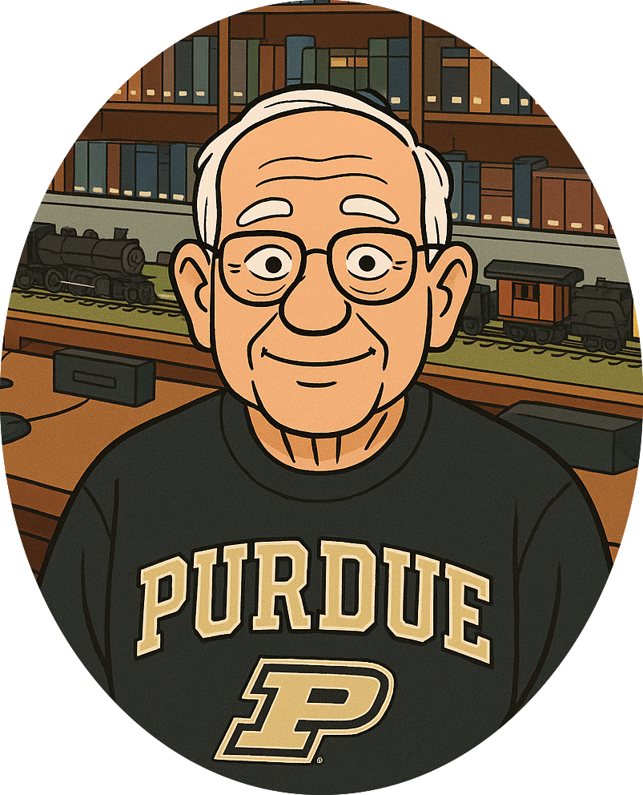

---
​---
title: Terry G
​---
---

I grew up near Toledo, Ohio, attended Purdue University and received BS and MS degrees in Civil (Structural) Engineering. After graduation, I moved to Houston and joined Exxon where I worked my entire career. I started out designing offshore platforms, became involved in project management and spent about 15 years on overseas assignments in Australia, Norway, Malaysia and Qatar.

I've always had an interest in personal computers, purchasing my first, an Apple II+, in 1981. While working, I used "IBM-compatible" hardware and Windows-based software. After retiring I returned to the Apple ecosystem. 